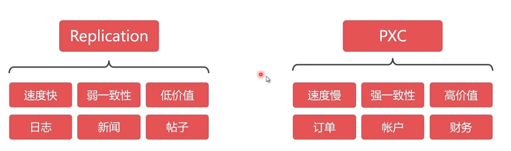

# 搭建mysql高可用集群


## 前置知识

```
mysql高可用集群方案，不建议使用Replication，建议使用pxc。因为弱一致性会有问题，比如说a节点数据库显示我购买成功，b 节点数据库显示没有成功，这就麻烦了，而pxc方案是在全部节点都写入成功之后才会告诉你成功，是可读可写双向同步的。
```


	

```
Replication
速度快，但仅能保证弱一致性，适用于保存价值不高的数据，比如日志、帖子、新闻等。
采用master-slave结构，在master写入会同步到slave，能从slave读出；但在slave写入无法同步到master。
采用异步复制，master写入成功就向客户端返回成功，但是同步slave可能失败，会造成无法从slave读出的结果。

PXC (Percona XtraDB Cluster，MySQL改进版，性能提升很大)
速度慢，但能保证强一致性，适用于保存价值较高的数据，比如订单、客户、支付等。
数据同步是双向的，在任一节点写入数据，都会同步到其他所有节点，在任何节点上都能同时读写。
采用同步复制，向任一节点写入数据，只有所有节点都同步成功后，才会向客户端返回成功。事务在所有节点要么同时提交，要么不提交。
```


## 一、先搭建普通集群

##### 0、常用操作

```java
docker stop pxcmaster pxcslave1 pxcslave2
docker rm pxcmaster pxcslave1 pxcslave2
docker volume rm v_pxc_master v_pxc_slave1 v_pxc_slave2
```


##### 1、拉取镜像并改名

```
docker pull percona/percona-xtradb-cluster:5.7.33
docker tag percona/percona-xtradb-cluster:5.7 pxc:5.7.33
```


##### 2、出于安全考虑，将PXC集群放置于docker内部网络中，只需将宿主机端口与之映射并开放出来即可

```
docker network create --subnet=172.18.0.0/16 pxc_net
--subnet=172.18.0.0/16：自定义网段172.18.0.0，16是指16位子网掩码，pxc_net 网段名称

docker network create --driver bridge --subnet 172.18.0.0/16 --gateway 172.18.0.1  mynet
--driver bridge：网络模式为 桥接模式
--subnet 172.18.0.0/16： 设置子网
--gateway 172.18.0.1：设置网关
--mynet：自定义的network名
```


##### 3、由于PXC较为特殊，无法直接使用映射目录的方法做映射（使用后会闪退），故使用docker卷

```
docker volume create --name v_pxc_master && docker volume create --name v_pxc_slave1 && docker volume create --name v_pxc_slave2
```

查看docker卷：

```
docker volume inspect v_pxc_master
```


##### 4、启动三个节点

```
### 第1个节点
docker run -d -p 3306:3306 -v v_pxc_master:/var/lib/mysql -e MYSQL_ROOT_PASSWORD=Pwd@123 -e CLUSTER_NAME=PXC -e XTRABACKUP_PASSWORD=Pwd@123 --privileged --name=pxcmaster --net=pxc_net --ip 172.18.0.2 pxc:5.7.33

参数说明：
-d  默认在后台运行
-p  3306（宿主）:3306（容器）   端口映射，将容器3306端口映射到宿主3306坤口
-v  目录映射，将第四步创建的v1映射到容器/var/lib/mysql
-e MYSQL_ROOT_PASSROWD  创建的用户实例的密码，默认实例root
-e CLUSTER_JOIN 加入指定集群（指定的节点为主节点）
-e CLUSTER_NAME  集群名称
-e XTRABACKUP_PASSWORD  数据库之间同步使用的密码
--privileged  权限.给予最高权限(真正的拿到root权限)
--name 给容器容命名
--net 使用内部网段
--ip 内部网段分到的地址
pxc:5.7.33 指的是镜像及其版本
```

以root用户进入master ，编辑/etc/mysql/node.cnf（开启主节点的bin_log，用于后续MYSQL-MAXWELL-ES）

```
docker exec -it --user root pxcmaster /bin/bash
vi /etc/mysql/node.cnf

[mysql]
default-character-set=utf8mb4

[mysqld]
character-set-client-handshake=FALSE
character-set-server=utf8mb4
collation-server=utf8mb4_bin
init_connect='SET NAMES utf8mb4'

sql_mode=STRICT_TRANS_TABLES,NO_ZERO_IN_DATE,NO_ZERO_DATE,ERROR_FOR_DIVISION_BY_ZERO,NO_AUTO_CREATE_USER,NO_ENGINE_SUBSTITUTION

server_id=1
log-bin=mysql-bin
binlog_format=ROW

wait_timeout=28800
interactive_timeout=28800
default-time-zone='+08:00'

[client]
default-character-set=utf8mb4
```

**退出容器，并重启**:  docker restart pxcmaster

**设置最大连接数：**

```
show variables like '%connect%';
set global max_connections=1000;
set global max_user_connections=500;
FLUSH PRIVILEGES;
```


```
### 第2个节点
docker run -d -p 3307:3306 -v v_pxc_slave1:/var/lib/mysql -e MYSQL_ROOT_PASSWORD=Pwd@123 -e CLUSTER_NAME=PXC -e XTRABACKUP_PASSWORD=Pwd@123 -e CLUSTER_JOIN=pxcmaster --privileged --name=pxcslave1 --net=pxc_net --ip 172.18.0.3 pxc:5.7.33
```

以root用户进入slave1 ，编辑/etc/mysql/node.cnf

```
docker exec -it --user root pxcslave1 /bin/bash
vi /etc/mysql/node.cnf

[mysql]
default-character-set=utf8mb4

[mysqld]
character-set-client-handshake=FALSE
character-set-server=utf8mb4
collation-server=utf8mb4_bin
init_connect='SET NAMES utf8mb4'

sql_mode=STRICT_TRANS_TABLES,NO_ZERO_IN_DATE,NO_ZERO_DATE,ERROR_FOR_DIVISION_BY_ZERO,NO_AUTO_CREATE_USER,NO_ENGINE_SUBSTITUTION

wait_timeout=28800
interactive_timeout=28800
default-time-zone='+08:00'

[client]
default-character-set=utf8mb4
```

**退出容器，并重启**:  docker restart pxcslave1

**设置最大连接数：**

```
show variables like '%connect%';
set global max_connections=1000;
set global max_user_connections=500;
FLUSH PRIVILEGES;
```


```
### 第3个节点
docker run -d -p 3308:3306 -v v_pxc_slave2:/var/lib/mysql -e MYSQL_ROOT_PASSWORD=Pwd@123 -e CLUSTER_NAME=PXC -e XTRABACKUP_PASSWORD=Pwd@123 -e CLUSTER_JOIN=pxcmaster --privileged --name=pxcslave2 --net=pxc_net --ip 172.18.0.4 pxc:5.7.33
```

以root用户进入slave2 ，编辑/etc/mysql/node.cnf

```
docker exec -it --user root pxcslave2 /bin/bash
vi /etc/mysql/node.cnf

[mysql]
default-character-set=utf8mb4

[mysqld]
character-set-client-handshake=FALSE
character-set-server=utf8mb4
collation-server=utf8mb4_bin
init_connect='SET NAMES utf8mb4'

sql_mode=STRICT_TRANS_TABLES,NO_ZERO_IN_DATE,NO_ZERO_DATE,ERROR_FOR_DIVISION_BY_ZERO,NO_AUTO_CREATE_USER,NO_ENGINE_SUBSTITUTION

wait_timeout=28800
interactive_timeout=28800
default-time-zone='+08:00'

[client]
default-character-set=utf8mb4
```

**退出容器，并重启**:  docker restart pxcslave2

**设置最大连接数：**

```
show variables like '%connect%';
set global max_connections=1000;
set global max_user_connections=500;
FLUSH PRIVILEGES;
```


## 二、HA、负载均衡

使用支持TCP/IP协议的harpoxy中间件进行负载均衡

##### 1、拉取镜像

```
docker pull haproxy:2.3.9
```


##### 2、宿主机创建配置文件
```
mkdir /data/haproxy

touch /data/haproxy/haproxy.cfg
```

文件内容：

```
global
    #容器的工作目录
    chroot /usr/local/etc/haproxy
    #日志文件，使用rsyslog服务中local5日志设备（/var/log/local5），等级info
    log 127.0.0.1 local5 info
    #守护进程运行
    daemon
defaults
    log global
    mode    http
    #日志格式
    option  httplog
    #日志中不记录负载均衡的心跳检测记录
    option  dontlognull
    #连接超时（毫秒）
    timeout connect 5000
    #客户端超时（毫秒）
    timeout client  50000
    #服务器超时（毫秒）
    timeout server  50000
#监控界面   
listen  admin_stats
    #监控界面的访问的IP和端口
    bind  0.0.0.0:8888
    #访问协议
    mode        http
    #URI相对地址
    stats uri   /dbs
    #统计报告格式
    stats realm     Global\ statistics
    #登陆帐户信息
    stats auth  root:Pwd@123
#数据库负载均衡
listen  proxy-mysql
    #访问的IP和端口
    bind  0.0.0.0:3306  
    #网络协议
    mode  tcp
    #负载均衡算法（轮询算法）
    #轮询算法：roundrobin
    #权重算法：static-rr
    #最少连接算法：leastconn
    #请求源IP算法：source 
    balance  roundrobin
    #日志格式
    option  tcplog
    #在MySQL中创建一个没有权限的haproxy用户，密码为空。Haproxy使用这个账户对MySQL数据库心跳检测
    option  mysql-check user haproxy
    server  MySQL_master 172.18.0.2:3306 check weight 1 maxconn 2000  
    server  MySQL_slave1 172.18.0.3:3306 check weight 1 maxconn 2000  
    server  MySQL_slave2 172.18.0.4:3306 check weight 1 maxconn 2000 
    #使用keepalive检测死链
    option  tcpka  
```


##### 3、分别在每个mysql节点上创建 haproxy 账号

```
CREATE USER 'haproxy'@'%' IDENTIFIED BY '';
```


##### 4、启动容器，8888:8888为管理界面的端口(http://x.x.x.x:8888/dbs)
```
docker run -it -d -p 8888:8888 -p 3309:3306 -v /data/haproxy:/usr/local/etc/haproxy --name haproxy --privileged --net=mysql_net --ip 172.18.0.5 haproxy:2.3.9
```


##### 5、进入容器，启动haproxy
```
docker exec -it --user root haproxy  /bin/bash

haproxy -f /usr/local/etc/haproxy/haproxy.cfg
```


### 三、mysql集群起、停顺序

- 集群起、停的顺序是固定的，并且是相反的

- 启动顺序：主节点 => slave节点

- 关闭顺序：slave节点 => 主节点

- **启动容器时，必须先启动主节点，再启动从节点，否则会报错、当前从节点无法加入集群**

- **停止容器时，必须先停止从节点，再停止主节点，否则会造成短暂可读、不可写的状态**

- **进入容器，备份数据库：**

  ```
  #进入容器
  docker exec -it --user root mysqlmaster  /bin/bash
  #备份数据库
mysqldump -uroot -pPwd@123  spartacus>spartacus.sql --skip_add_locks --skip-lock-tables;
  #拷贝到宿主机
docker cp mysql:/spartacus.sql /root
  ```
  
  <font color=red>**特别注意：**</font>
  
  ```javascript
  show variables like 'lower%';
  
  lower_case_table_names = 1  表名不区分大小写
  lower_case_table_names = 0  表名区分大小写的 
  ```


##########################################**番外-通过docker-compose搭建高可用集群**######################################

```
一、先搭建普通集群
#创建专属网段
docker network create --subnet=172.19.0.0/24 pxc_net

#创建并启动容器
docker-compose -f ./pxc-master.yml up -d
#查看容器状态
docker-compose -f ./pxc-master.yml ps
#停止、启动容器
docker-compose -f ./pxc-master.yml stop
docker-compose -f ./pxc-master.yml start
#进入容器
docker-compose exec pxc_master bash
#删除容器、删除卷
docker-compose -f ./pxc-master.yml down --volumes


#创建并启动容器
docker-compose -f ./pxc-slaves.yml up -d
#查看容器状态
docker-compose -f ./pxc-slaves.yml ps
#停止、启动容器
docker-compose -f ./pxc-slaves.yml stop
docker-compose -f ./pxc-slaves.yml start
#进入容器
docker-compose exec pxc_slave1 bash
#删除容器、删除卷
docker-compose -f ./pxc-slaves.yml down --volumes

...

二、HA、负载均衡
...

三、mysql集群起、停顺序
...
```

