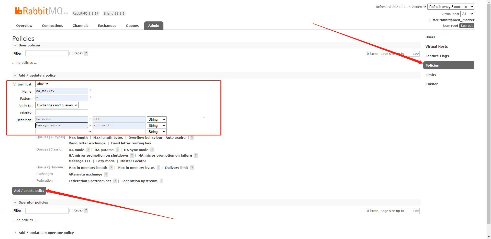

# 搭建rabbitmq高可用集群


## 前置说明

- 云虚拟主机本地防火墙一定要关闭

- 内部网络安全组开放对应的端口

- 云虚拟主机已安装docker，已拉取rabbitmq镜像

-  注意：每个节点间隔几十秒再启动（如果失败，则删除容器、映射目录，然后重新创建）
  
- 常用操作：
  
  - 停止所有容器：docker stop $(docker ps -a -q)
  
  - 删除所有已停止容器：docker rm $(docker ps -a -q)
  
  - 删除映射目录：rm -rf /data/rabbitmq/
  
    

## 一、先搭建普通集群

```
1、master
docker run -d --hostname host_master --name rabbitmaster -p 5672:5672 -p 15672:15672 -p 15674:15674 -p 61613:61613 -e RABBITMQ_NODENAME=rabbit -e RABBITMQ_DEFAULT_USER=root -e RABBITMQ_DEFAULT_PASS=Pwd@123  -e RABBITMQ_ERLANG_COOKIE='rabbitmq_cookie_011101' --privileged=true -v /data/rabbitmq/master/lib:/var/lib/rabbitmq -v /data/rabbitmq/master/log:/var/log/rabbitmq rabbitmq:3.8.14-management


2、slave1
docker run -d --hostname host_slave1 --name rabbitslave1 -p 6672:5672 -p 25672:15672 -p 25674:15674 -p 61614:61613 --link rabbitmaster:host_master  -e RABBITMQ_NODENAME=rabbit -e RABBITMQ_DEFAULT_USER=root -e RABBITMQ_DEFAULT_PASS=Pwd@123  -e RABBITMQ_ERLANG_COOKIE='rabbitmq_cookie_011101' --privileged=true -v /data/rabbitmq/slave1/lib:/var/lib/rabbitmq -v /data/rabbitmq/slave1/log:/var/log/rabbitmq rabbitmq:3.8.14-management


3、slave2
docker run -d --hostname host_slave2 --name rabbitslave2 -p 7672:5672 -p 35672:15672 -p 35674:15674 -p 61615:61613 --link  rabbitmaster:host_master --link rabbitslave1:host_slave1 -e RABBITMQ_NODENAME=rabbit -e RABBITMQ_DEFAULT_USER=root -e RABBITMQ_DEFAULT_PASS=Pwd@123  -e RABBITMQ_ERLANG_COOKIE='rabbitmq_cookie_011101' --privileged=true -v /data/rabbitmq/slave2/lib:/var/lib/rabbitmq -v /data/rabbitmq/slave2/log:/var/log/rabbitmq rabbitmq:3.8.14-management


参数说明：
--hostname 自定义Docker容器的 hostname

--link <容器名>:<hostname> 容器之间连接,link不可或缺，使得三个容器能互相通信

--privileged=true 使用该参数，container内的root拥有真正的root权限，否则容器出现permission denied

-v 宿主机和容器路径映射

参数 RABBITMQ_NODENAME，缺省 Unix*: rabbit@$HOSTNAME
参数 RABBITMQ_DEFAULT_USER, 登陆rabbitmq默认用户名
参数 RABBITMQ_DEFAULT_PASS, 登陆rabbitmq默认密码
参数 RABBITMQ_ERLANG_COOKIE：一个集群内Erlang Cookie参数的值必须相同， 相当于不同节点之间通讯的密钥，erlang.cookie是erlang的分布式token文件，集群内各个节点的erlang.cookie需要相同，才可以互相通信
```


4、组成普通集群

```
节点一配置集群
docker exec -it rabbitmaster bash
#清除所有队列数据
#rabbitmqctl stop_app   #关闭应用（关闭当前启动的节点）
#rabbitmqctl reset      #从管理数据库中移除所有数据，删除所有持久化的消息（这个命令要在rabbitmqctl stop_app之后使用）
#rabbitmqctl start_app  #启动应用，和上述关闭命令配合使用，达到清空队列的目的

#安装stomp插件（用作websocket消息代理）
rabbitmq-plugins enable rabbitmq_stomp
rabbitmq-plugins enable rabbitmq_web_stomp
exit


节点二加入集群，--ram是以内存方式加入,忽略该参数默认为磁盘节点。
docker exec -it rabbitslave1 bash
rabbitmqctl stop_app
rabbitmqctl reset
rabbitmqctl join_cluster --ram rabbit@host_master
rabbitmqctl start_app

#安装stomp插件（用作websocket消息代理）
rabbitmq-plugins enable rabbitmq_stomp
rabbitmq-plugins enable rabbitmq_web_stomp
exit


节点三加入集群，--ram是以内存方式加入,忽略该参数默认为磁盘节点。
docker exec -it rabbitslave2 bash
rabbitmqctl stop_app
rabbitmqctl reset
rabbitmqctl join_cluster --ram rabbit@host_master
rabbitmqctl start_app

#安装stomp插件（用作websocket消息代理）
rabbitmq-plugins enable rabbitmq_stomp
rabbitmq-plugins enable rabbitmq_web_stomp
exit

#查看集群节点状态,配置启动了3个节点，1个磁盘节点和2个内存节点

rabbitmqctl cluster_status
```


## 二、配置集群策略，使普通集群变成HA集群

- 背景
  - 前面搭建了普通集群，如果磁盘节点挂掉后，如果没开启持久化数据就丢失了，其他节点也无法获取消息，所以我们这个集群方案需要进一步改造为**镜像模式集群**。
- 策略policy介绍

```
rabbitmq的策略policy是用来控制和修改集群的vhost队列和Exchange复制行为，就是要设置哪些Exchange或者queue的数据需要复制、同步，以及如何复制同步
```

- 开放宿主机的15672/25672/35672端口

- 创建一个策略来匹配队列

  - 路径：rabbitmq管理页面 —> Admin —> Policies —> Add / update a policy

  - 参数: 策略会同步同一个VirtualHost中的交换器和队列数据

    - name：自定义策略名称
    - Pattern：^ 匹配符，代表匹配所有
    - Definition：ha-mode=all 为匹配类型，分为3种模式：all（表示所有的queue）

    ```
    ha-mode: 指明镜像队列的模式，可选下面的其中一个
    	all：表示在集群中所有的节点上进行镜像同步（一般都用这个参数）
    	exactly：表示在指定个数的节点上进行镜像同步，节点的个数由ha-params指定
    	nodes：表示在指定的节点上进行镜像同步，节点名称通过ha-params指定
    ```

    ```
    ha-sync-mode：镜像消息同步方式 automatic（自动），manually（手动）
    ```

**配置如下图：**




### 三、集群起、停顺序

- 集群起、停的顺序是固定的，并且是相反的
- 启动顺序：磁盘节点 => 内存节点
- 关闭顺序：内存节点 => 磁盘节点
- **最后关闭必须是磁盘节点，否则容易造成集群启动失败、数据丢失等异常情况**